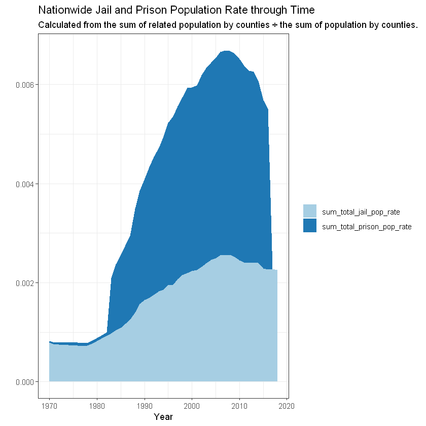
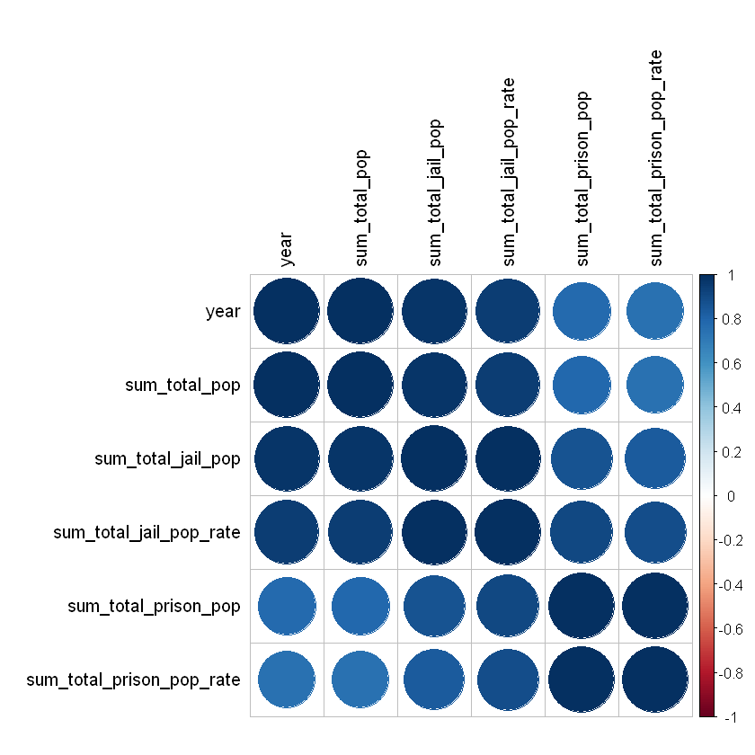
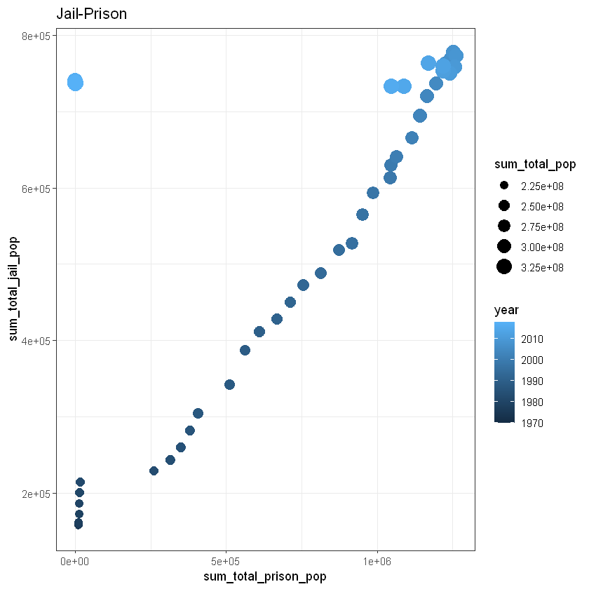
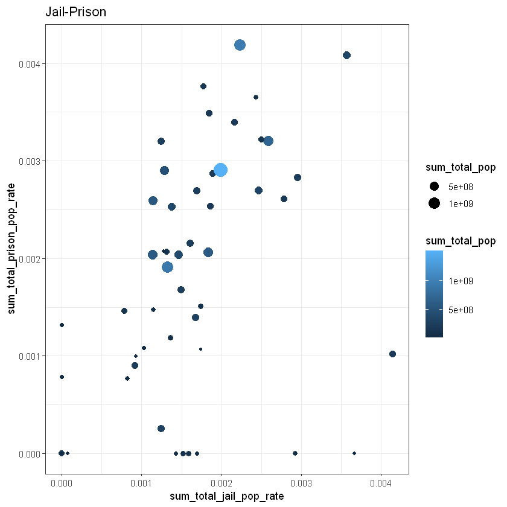
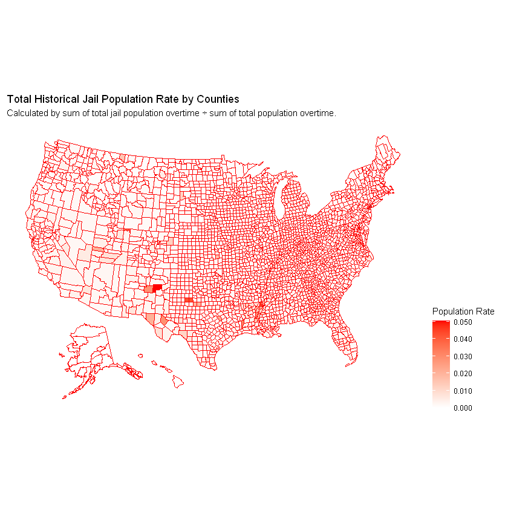
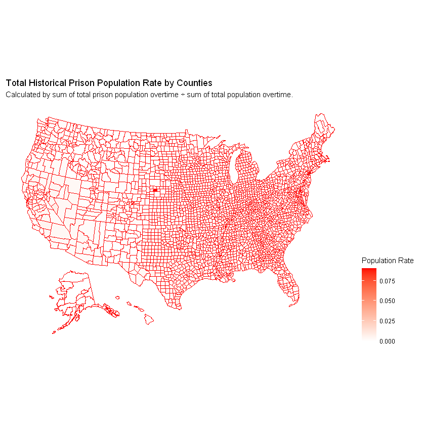
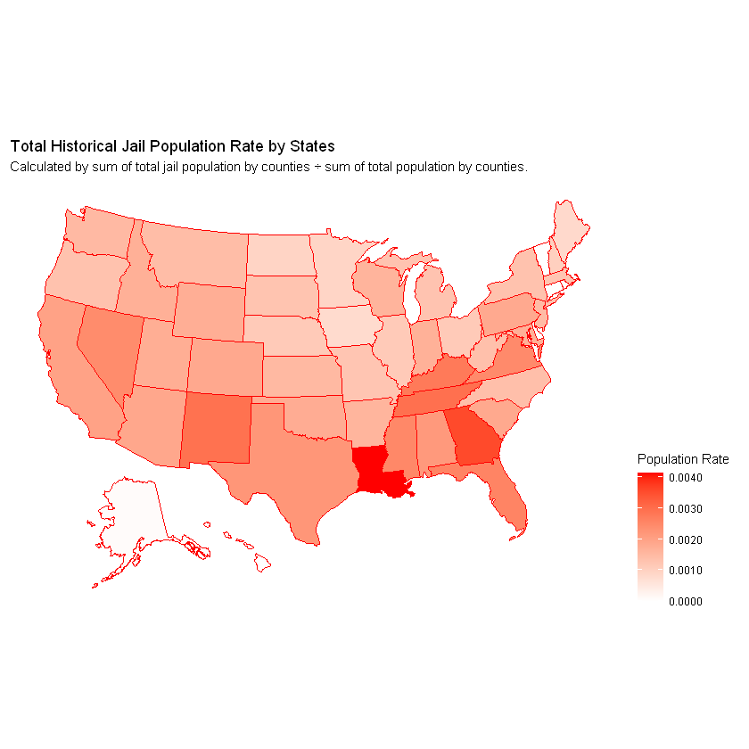
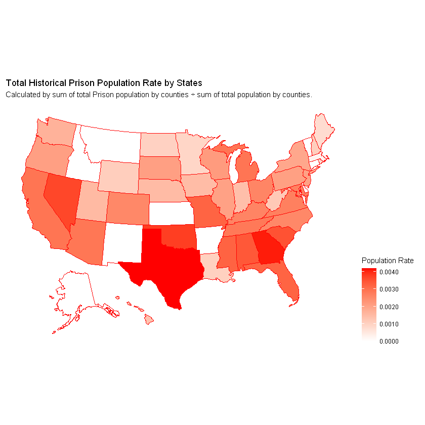

::: {.cell .markdown}
## Hugo Hou
## 2021/11/19
# Introduction

In this assignment, we use the data analysis and visualization skills to
expose patterns of incarceration form the provided data.

:::

::: {.cell .code execution_count="1"}
``` {.R}
library(VIM)
library(mice)

library(MixAll)
library(rtkore)

library(arm)

library(jtools)
library(ggstance)
library(ggplot2)

library(interactions)

library(corrplot)

library(maps)
library(RColorBrewer)
library(tidyverse)

library(klaR)
library(naivebayes)
library(dplyr)
library(psych)

library(lme4)
library(lattice)

library(plotly)

library(readr)
library(dplyr)

library(leaflet)
library(htmltools)
library(ggplot2)
library(gridExtra)
library(lubridate)
library(VIM)
library(usmap)

library(gganimate)
library(ggrepel)
library(gapminder)
```
:::

::: {.cell .code execution_count="3" scrolled="true"}
``` {.R}
data <- read.csv("incarceration_trends.csv")
head(data)
```

::: {.output .display_data}
```{=html}
<table class="dataframe">
<caption>A data.frame: 6 × 121</caption>
<thead>
	<tr><th></th><th scope=col>yfips</th><th scope=col>year</th><th scope=col>fips</th><th scope=col>state</th><th scope=col>county_name</th><th scope=col>total_pop</th><th scope=col>total_pop_15to64</th><th scope=col>female_pop_15to64</th><th scope=col>male_pop_15to64</th><th scope=col>aapi_pop_15to64</th><th scope=col>...</th><th scope=col>native_prison_pop_rate</th><th scope=col>white_prison_pop_rate</th><th scope=col>total_prison_adm_rate</th><th scope=col>female_prison_adm_rate</th><th scope=col>male_prison_adm_rate</th><th scope=col>aapi_prison_adm_rate</th><th scope=col>black_prison_adm_rate</th><th scope=col>latinx_prison_adm_rate</th><th scope=col>native_prison_adm_rate</th><th scope=col>white_prison_adm_rate</th></tr>
	<tr><th></th><th scope=col>&lt;int&gt;</th><th scope=col>&lt;int&gt;</th><th scope=col>&lt;int&gt;</th><th scope=col>&lt;chr&gt;</th><th scope=col>&lt;chr&gt;</th><th scope=col>&lt;int&gt;</th><th scope=col>&lt;int&gt;</th><th scope=col>&lt;int&gt;</th><th scope=col>&lt;int&gt;</th><th scope=col>&lt;dbl&gt;</th><th scope=col>...</th><th scope=col>&lt;dbl&gt;</th><th scope=col>&lt;dbl&gt;</th><th scope=col>&lt;dbl&gt;</th><th scope=col>&lt;dbl&gt;</th><th scope=col>&lt;dbl&gt;</th><th scope=col>&lt;dbl&gt;</th><th scope=col>&lt;dbl&gt;</th><th scope=col>&lt;dbl&gt;</th><th scope=col>&lt;dbl&gt;</th><th scope=col>&lt;dbl&gt;</th></tr>
</thead>
<tbody>
	<tr><th scope=row>1</th><td>197001001</td><td>1970</td><td>1001</td><td>AL</td><td>Autauga County</td><td>24661</td><td>14154</td><td>7293</td><td>6861</td><td>NA</td><td>...</td><td>NA</td><td>NA</td><td>NA</td><td>NA</td><td>NA</td><td>NA</td><td>NA</td><td>NA</td><td>NA</td><td>NA</td></tr>
	<tr><th scope=row>2</th><td>197101001</td><td>1971</td><td>1001</td><td>AL</td><td>Autauga County</td><td>25503</td><td>14765</td><td>7585</td><td>7180</td><td>NA</td><td>...</td><td>NA</td><td>NA</td><td>NA</td><td>NA</td><td>NA</td><td>NA</td><td>NA</td><td>NA</td><td>NA</td><td>NA</td></tr>
	<tr><th scope=row>3</th><td>197201001</td><td>1972</td><td>1001</td><td>AL</td><td>Autauga County</td><td>27156</td><td>15939</td><td>8168</td><td>7771</td><td>NA</td><td>...</td><td>NA</td><td>NA</td><td>NA</td><td>NA</td><td>NA</td><td>NA</td><td>NA</td><td>NA</td><td>NA</td><td>NA</td></tr>
	<tr><th scope=row>4</th><td>197301001</td><td>1973</td><td>1001</td><td>AL</td><td>Autauga County</td><td>28453</td><td>16906</td><td>8651</td><td>8255</td><td>NA</td><td>...</td><td>NA</td><td>NA</td><td>NA</td><td>NA</td><td>NA</td><td>NA</td><td>NA</td><td>NA</td><td>NA</td><td>NA</td></tr>
	<tr><th scope=row>5</th><td>197401001</td><td>1974</td><td>1001</td><td>AL</td><td>Autauga County</td><td>29261</td><td>17578</td><td>8992</td><td>8586</td><td>NA</td><td>...</td><td>NA</td><td>NA</td><td>NA</td><td>NA</td><td>NA</td><td>NA</td><td>NA</td><td>NA</td><td>NA</td><td>NA</td></tr>
	<tr><th scope=row>6</th><td>197501001</td><td>1975</td><td>1001</td><td>AL</td><td>Autauga County</td><td>29716</td><td>18007</td><td>9210</td><td>8797</td><td>NA</td><td>...</td><td>NA</td><td>NA</td><td>NA</td><td>NA</td><td>NA</td><td>NA</td><td>NA</td><td>NA</td><td>NA</td><td>NA</td></tr>
</tbody>
</table>
```
:::
:::

::: {.cell .markdown}
We choosed the data \"year\", \"fips\", \"state\", \"county_name\",
\"total_pop\", \"total_jail_pop\", \"total_jail_pop_rate\",
\"total_prison_pop\", and \"total_prison_pop_rate\" for analysis on the
trends of incarceration through time and their spacial patterns.
:::

::: {.cell .code execution_count="4"}
``` {.R}
columns <- c("year","fips","state","county_name", "total_pop",
             "total_jail_pop","total_jail_pop_rate","total_prison_pop","total_prison_pop_rate")
selected_data = data[columns]
colnames(selected_data) <- c("year","fips","state","county_name", "total_pop",
             "total_jail_pop","total_jail_pop_rate","total_prison_pop","total_prison_pop_rate")
str(selected_data)
```

::: {.output .stream .stdout}
    'data.frame':	153811 obs. of  9 variables:
     $ year                 : int  1970 1971 1972 1973 1974 1975 1976 1977 1978 1979 ...
     $ fips                 : int  1001 1001 1001 1001 1001 1001 1001 1001 1001 1001 ...
     $ state                : chr  "AL" "AL" "AL" "AL" ...
     $ county_name          : chr  "Autauga County" "Autauga County" "Autauga County" "Autauga County" ...
     $ total_pop            : int  24661 25503 27156 28453 29261 29716 29892 30457 30879 32050 ...
     $ total_jail_pop       : num  NA NA NA NA NA NA NA NA 37 35.2 ...
     $ total_jail_pop_rate  : num  NA NA NA NA NA ...
     $ total_prison_pop     : num  NA NA NA NA NA NA NA NA NA NA ...
     $ total_prison_pop_rate: num  NA NA NA NA NA NA NA NA NA NA ...
:::
:::

::: {.cell .markdown}
## Data Calculation

First, we convert all NA value into zero for doing the calculation.
:::

::: {.cell .code execution_count="5"}
``` {.R}
selected_data[is.na(selected_data)] = 0
str(selected_data)
```

::: {.output .stream .stdout}
    'data.frame':	153811 obs. of  9 variables:
     $ year                 : int  1970 1971 1972 1973 1974 1975 1976 1977 1978 1979 ...
     $ fips                 : int  1001 1001 1001 1001 1001 1001 1001 1001 1001 1001 ...
     $ state                : chr  "AL" "AL" "AL" "AL" ...
     $ county_name          : chr  "Autauga County" "Autauga County" "Autauga County" "Autauga County" ...
     $ total_pop            : int  24661 25503 27156 28453 29261 29716 29892 30457 30879 32050 ...
     $ total_jail_pop       : num  0 0 0 0 0 0 0 0 37 35.2 ...
     $ total_jail_pop_rate  : num  0 0 0 0 0 ...
     $ total_prison_pop     : num  0 0 0 0 0 0 0 0 0 0 ...
     $ total_prison_pop_rate: num  0 0 0 0 0 0 0 0 0 0 ...
:::
:::

::: {.cell .markdown}
We hereby used the clean data above to generate the sum of total
population, and the sum of jail population and prison population with
their ratio within the total population through time for doing temporal
analysis.
:::

::: {.cell .code execution_count="6"}
``` {.R}
selected_data_year <- selected_data %>% 
  group_by(year) %>%
  summarize(sum_total_pop= sum(as.numeric(total_pop)),
            sum_total_jail_pop= sum(as.numeric(total_jail_pop)),
            sum_total_jail_pop_rate = sum_total_jail_pop/sum_total_pop,
            sum_total_prison_pop= sum(as.numeric(total_prison_pop)),
            sum_total_prison_pop_rate = sum_total_prison_pop/sum_total_pop
            )
head(selected_data_year)
```

::: {.output .display_data}
```{=html}
<table class="dataframe">
<caption>A tibble: 6 × 6</caption>
<thead>
	<tr><th scope=col>year</th><th scope=col>sum_total_pop</th><th scope=col>sum_total_jail_pop</th><th scope=col>sum_total_jail_pop_rate</th><th scope=col>sum_total_prison_pop</th><th scope=col>sum_total_prison_pop_rate</th></tr>
	<tr><th scope=col>&lt;int&gt;</th><th scope=col>&lt;dbl&gt;</th><th scope=col>&lt;dbl&gt;</th><th scope=col>&lt;dbl&gt;</th><th scope=col>&lt;dbl&gt;</th><th scope=col>&lt;dbl&gt;</th></tr>
</thead>
<tbody>
	<tr><td>1970</td><td>203882263</td><td>160727.0</td><td>0.0007883326</td><td> 6635</td><td>3.254329e-05</td></tr>
	<tr><td>1971</td><td>206708519</td><td>155679.0</td><td>0.0007531329</td><td> 8607</td><td>4.163834e-05</td></tr>
	<tr><td>1972</td><td>209163959</td><td>156233.6</td><td>0.0007469433</td><td> 8914</td><td>4.261728e-05</td></tr>
	<tr><td>1973</td><td>211237199</td><td>156788.0</td><td>0.0007422368</td><td> 9764</td><td>4.622292e-05</td></tr>
	<tr><td>1974</td><td>213218350</td><td>157342.2</td><td>0.0007379394</td><td>10661</td><td>5.000039e-05</td></tr>
	<tr><td>1975</td><td>215335855</td><td>157896.2</td><td>0.0007332554</td><td>12040</td><td>5.591266e-05</td></tr>
</tbody>
</table>
```
:::
:::

::: {.cell .code execution_count="7"}
``` {.R}
selected_data_year_type <- pivot_longer(
    selected_data_year,
    cols = c(sum_total_prison_pop_rate,sum_total_jail_pop_rate),
    names_to = "type"
)
head(selected_data_year_type)
```

::: {.output .display_data}
```{=html}
<table class="dataframe">
<caption>A tibble: 6 × 6</caption>
<thead>
	<tr><th scope=col>year</th><th scope=col>sum_total_pop</th><th scope=col>sum_total_jail_pop</th><th scope=col>sum_total_prison_pop</th><th scope=col>type</th><th scope=col>value</th></tr>
	<tr><th scope=col>&lt;int&gt;</th><th scope=col>&lt;dbl&gt;</th><th scope=col>&lt;dbl&gt;</th><th scope=col>&lt;dbl&gt;</th><th scope=col>&lt;chr&gt;</th><th scope=col>&lt;dbl&gt;</th></tr>
</thead>
<tbody>
	<tr><td>1970</td><td>203882263</td><td>160727.0</td><td>6635</td><td>sum_total_prison_pop_rate</td><td>3.254329e-05</td></tr>
	<tr><td>1970</td><td>203882263</td><td>160727.0</td><td>6635</td><td>sum_total_jail_pop_rate  </td><td>7.883326e-04</td></tr>
	<tr><td>1971</td><td>206708519</td><td>155679.0</td><td>8607</td><td>sum_total_prison_pop_rate</td><td>4.163834e-05</td></tr>
	<tr><td>1971</td><td>206708519</td><td>155679.0</td><td>8607</td><td>sum_total_jail_pop_rate  </td><td>7.531329e-04</td></tr>
	<tr><td>1972</td><td>209163959</td><td>156233.6</td><td>8914</td><td>sum_total_prison_pop_rate</td><td>4.261728e-05</td></tr>
	<tr><td>1972</td><td>209163959</td><td>156233.6</td><td>8914</td><td>sum_total_jail_pop_rate  </td><td>7.469433e-04</td></tr>
</tbody>
</table>
```
:::
:::

::: {.cell .markdown}
Here, we generate the sum of total population, and the sum of jail
population and prison population with their ratio within the total
population through counties and states, for spatial analysis.
:::

::: {.cell .code execution_count="11" scrolled="false"}
``` {.R}
selected_data_county <- selected_data %>% 
  group_by(fips) %>%
  summarize(sum_total_pop= sum(as.numeric(total_pop)),
            sum_total_jail_pop= sum(as.numeric(total_jail_pop)),
            sum_total_jail_pop_rate = sum_total_jail_pop/sum_total_pop,
            sum_total_prison_pop= sum(as.numeric(total_prison_pop)),
            sum_total_prison_pop_rate = sum_total_prison_pop/sum_total_pop
            )
head(selected_data_county)
```

::: {.output .display_data}
```{=html}
<table class="dataframe">
<caption>A tibble: 6 × 6</caption>
<thead>
	<tr><th scope=col>fips</th><th scope=col>sum_total_pop</th><th scope=col>sum_total_jail_pop</th><th scope=col>sum_total_jail_pop_rate</th><th scope=col>sum_total_prison_pop</th><th scope=col>sum_total_prison_pop_rate</th></tr>
	<tr><th scope=col>&lt;int&gt;</th><th scope=col>&lt;dbl&gt;</th><th scope=col>&lt;dbl&gt;</th><th scope=col>&lt;dbl&gt;</th><th scope=col>&lt;dbl&gt;</th><th scope=col>&lt;dbl&gt;</th></tr>
</thead>
<tbody>
	<tr><td>1001</td><td>1987027</td><td> 3919.00</td><td>0.001972293</td><td> 5439</td><td>0.002737255</td></tr>
	<tr><td>1003</td><td>6130632</td><td>16585.49</td><td>0.002705348</td><td>18793</td><td>0.003065426</td></tr>
	<tr><td>1005</td><td>1285791</td><td> 2999.50</td><td>0.002332805</td><td> 5311</td><td>0.004130531</td></tr>
	<tr><td>1007</td><td> 912030</td><td> 1763.50</td><td>0.001933599</td><td> 1790</td><td>0.001962655</td></tr>
	<tr><td>1009</td><td>2192110</td><td> 3377.50</td><td>0.001540753</td><td> 3610</td><td>0.001646815</td></tr>
	<tr><td>1011</td><td> 539651</td><td> 1065.50</td><td>0.001974424</td><td> 2178</td><td>0.004035942</td></tr>
</tbody>
</table>
```
:::
:::

::: {.cell .code execution_count="12"}
``` {.R}
selected_data_state <- selected_data %>% 
# filter(year == 2000) %>%
  group_by(state) %>%
  summarize(sum_total_pop= sum(as.numeric(total_pop)),
            sum_total_jail_pop= sum(as.numeric(total_jail_pop)),
            sum_total_jail_pop_rate = sum_total_jail_pop/sum_total_pop,
            sum_total_prison_pop= sum(as.numeric(total_prison_pop)),
            sum_total_prison_pop_rate = sum_total_prison_pop/sum_total_pop
            )
head(selected_data_state)
```

::: {.output .display_data}
```{=html}
<table class="dataframe">
<caption>A tibble: 6 × 6</caption>
<thead>
	<tr><th scope=col>state</th><th scope=col>sum_total_pop</th><th scope=col>sum_total_jail_pop</th><th scope=col>sum_total_jail_pop_rate</th><th scope=col>sum_total_prison_pop</th><th scope=col>sum_total_prison_pop_rate</th></tr>
	<tr><th scope=col>&lt;chr&gt;</th><th scope=col>&lt;dbl&gt;</th><th scope=col>&lt;dbl&gt;</th><th scope=col>&lt;dbl&gt;</th><th scope=col>&lt;dbl&gt;</th><th scope=col>&lt;dbl&gt;</th></tr>
</thead>
<tbody>
	<tr><td>AK</td><td>  26875826</td><td>   2052.5</td><td>7.636975e-05</td><td>      0.0</td><td>0.000000000</td></tr>
	<tr><td>AL</td><td> 208210663</td><td> 450122.6</td><td>2.161861e-03</td><td> 707478.0</td><td>0.003397895</td></tr>
	<tr><td>AR</td><td> 123911561</td><td> 196949.5</td><td>1.589436e-03</td><td>      0.0</td><td>0.000000000</td></tr>
	<tr><td>AZ</td><td> 215651687</td><td> 407309.2</td><td>1.888736e-03</td><td> 618847.0</td><td>0.002869660</td></tr>
	<tr><td>CA</td><td>1497671767</td><td>2978184.5</td><td>1.988543e-03</td><td>4356789.3</td><td>0.002909042</td></tr>
	<tr><td>CO</td><td> 189293405</td><td> 351147.9</td><td>1.855046e-03</td><td> 480685.8</td><td>0.002539369</td></tr>
</tbody>
</table>
```
:::
:::

::: {.cell .markdown}
## Trends over Time

Here we display the nationwide trends of jail and prison population rate
in total population through time.
:::

::: {.cell .code execution_count="8"}
``` {.R}
ggplot(selected_data_year, aes(x = year)) +
  geom_area(aes(y=sum_total_jail_pop_rate+sum_total_prison_pop_rate,
                fill="sum_total_prison_pop_rate")) +
  geom_area(aes(y=sum_total_jail_pop_rate,
                fill="sum_total_jail_pop_rate")) +
  theme_bw()+
  theme(
    legend.title = element_blank()
  )+
  scale_fill_brewer(palette = "Paired")+
  labs(title='Nationwide Jail and Prison Population Rate through Time',
       subtitle='Calculated from the sum of related population by counties ÷ the sum of population by counties.')+
  ylab('')+
  xlab('Year')
```

::: {.output .display_data}
{height="420"
width="420"}
:::
:::

::: {.cell .markdown}
## Relationships between Variables

Here we use correlation analysis and other techniques to discover the
temporal and spatial relationships between the aforemenioned variables.
:::

::: {.cell .code execution_count="9"}
``` {.R}
cors <- cor(selected_data_year)
png(height=2800, width=3200, pointsize=32, file="cors.png")
corrplot(cors, tl.col = 'black')
corrplot(cors, add=TRUE, type="lower", method="number",
         diag=FALSE, tl.pos="n", cl.pos="n")
corrplot(cors, add=TRUE, type="upper", tl.pos="n", tl.col = 'black')
dev.off()
corrplot(cors,tl.col = 'black')
```

::: {.output .display_data}
```{=html}
<strong>png:</strong> 2
```
:::

::: {.output .display_data}
{height="420"
width="420"}
:::
:::

::: {.cell .code execution_count="10"}
``` {.R}
qplot(sum_total_prison_pop, sum_total_jail_pop,
      data=selected_data_year, 
      size=sum_total_pop, col=year, main="Jail-Prison") + theme_bw()
```

::: {.output .display_data}
{height="420"
width="420"}
:::
:::

::: {.cell .code execution_count="13"}
``` {.R}
qplot(sum_total_jail_pop_rate, sum_total_prison_pop_rate,
      data=selected_data_state, 
      size=sum_total_pop, col=sum_total_pop, main="Jail-Prison") + theme_bw()
```

::: {.output .display_data}
{height="420"
width="420"}
:::
:::

::: {.cell .markdown}
## Maps

Here we draw maps of data to show the calculated rate of jail and prison
population, from the county and state scale。
:::

::: {.cell .code execution_count="14"}
``` {.R}
plot_usmap (
  data = selected_data_county, values = "sum_total_jail_pop_rate", color = "red"
) +
scale_fill_continuous(
  low = "white", high = "red", name = "Population Rate", label = scales::comma
) +
labs(
  title = "Total Historical Jail Population Rate by Counties",
  subtitle = "Calculated by sum of total jail population overtime ÷ sum of total population overtime."
) +
theme(legend.position = "right")
```

::: {.output .display_data}
{height="420"
width="420"}
:::
:::

::: {.cell .code execution_count="15"}
``` {.R}
plot_usmap (
  data = selected_data_county, values = "sum_total_prison_pop_rate", color = "red"
) +
scale_fill_continuous(
  low = "white", high = "red", name = "Population Rate", label = scales::comma
) +
labs(
  title = "Total Historical Prison Population Rate by Counties",
  subtitle = "Calculated by sum of total prison population overtime ÷ sum of total population overtime."
) +
theme(legend.position = "right")
```

::: {.output .display_data}
{height="420"
width="420"}
:::
:::

::: {.cell .code execution_count="16"}
``` {.R}
plot_usmap(
  data = selected_data_state, values = "sum_total_jail_pop_rate", color = "red"
) + 
scale_fill_continuous(
  low = "white", high = "red", name = "Population Rate", label = scales::comma
) +
labs(
  title = "Total Historical Jail Population Rate by States",
  subtitle = "Calculated by sum of total jail population by counties ÷ sum of total population by counties."
) +
theme(legend.position = "right")
```

::: {.output .display_data}
{height="420"
width="420"}
:::
:::

::: {.cell .code execution_count="17" scrolled="false"}
``` {.R}
plot_usmap(
  data = selected_data_state, values = "sum_total_prison_pop_rate", color = "red"
) + 
scale_fill_continuous(
  low = "white", high = "red", name = "Population Rate", label = scales::comma
) +
labs(
  title = "Total Historical Prison Population Rate by States",
  subtitle = "Calculated by sum of total Prison population by counties ÷ sum of total population by counties."
) +
theme(legend.position = "right")
```

::: {.output .display_data}
{height="420"
width="420"}
:::
:::
